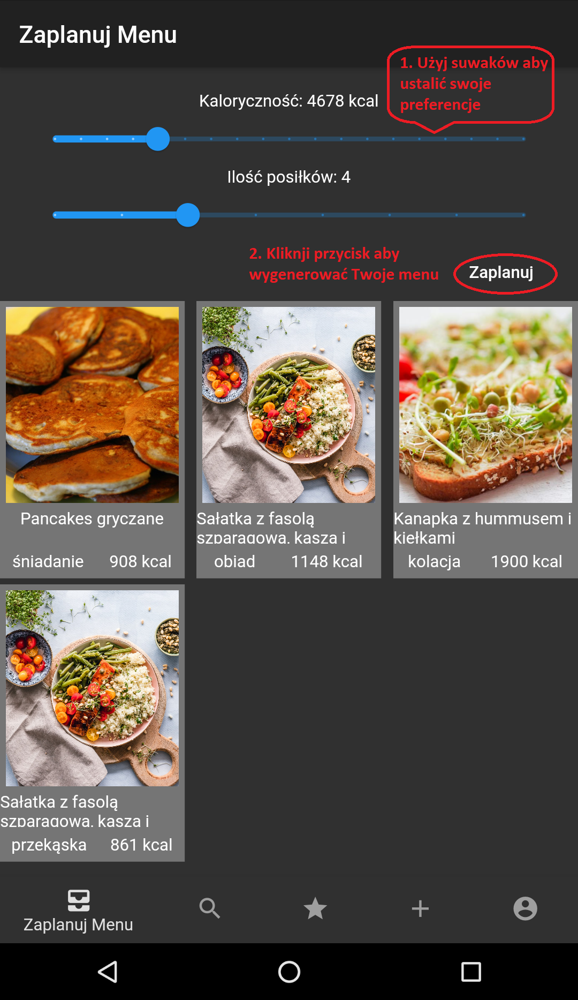
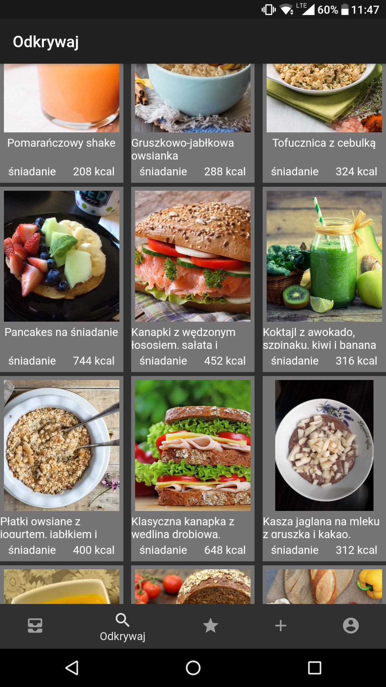
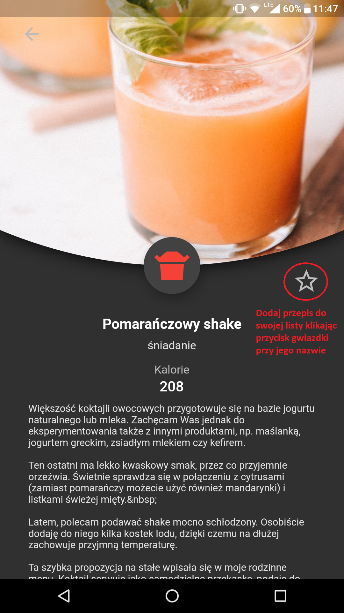
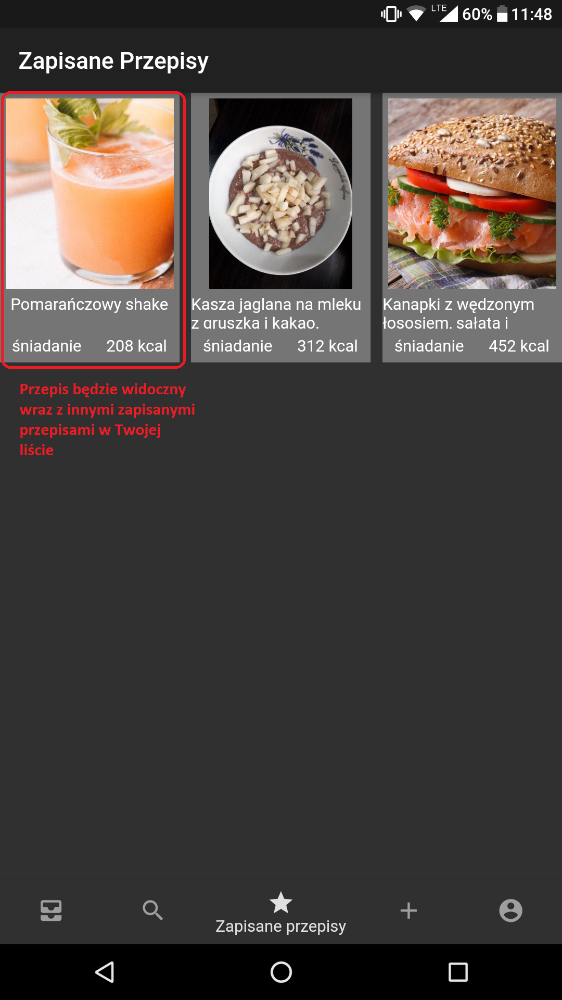
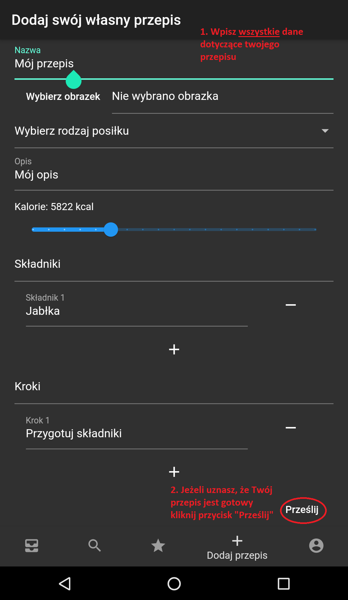

# jedzenioplanner

Aplikacja pozwalająca na przeglądanie i dodawanie przepisów do bazy Jedzenioplanner.

## Instrukcja obsługi
Aplikacja jest gotowa od razu po zainstalowaniu na urządzeniu.  
Dostęp do podstawowych funkcji nie wymaga dodatkowej konfiguracji

- Komponowanie własnego menu  
Dostosuj swoje kryteria i otrzymaj menu.

- Eksploruj  
Jeżeli nie masz wyznaczonych kryteriów, możesz też przeglądać obszerną bazę przepisów.

- Moja lista  
Ulubione przepisy można zapisać w swojej liście. Pozostają tam one nawet cały czas, również po zamknięciu aplikacji.

- Dodaj własny przepis  
Jeżeli masz własny przepis, którego nie ma jeszcze w bazie, a chciałbyś się nim podzielić to możesz go przesłać.  
Uwaga: Do korzystania z tej funkcji należy się zalogować, można skorzystać z własnego konta Google.

Jeżeli przepis zostanie przesłany bezproblemowo, pojawi się informacja o sukcesie:

W razie jakiegokolwiek błędu w strukturze zostaniesz odpowiednio powiadomiony po kliknięciu przycisku "Prześlij"